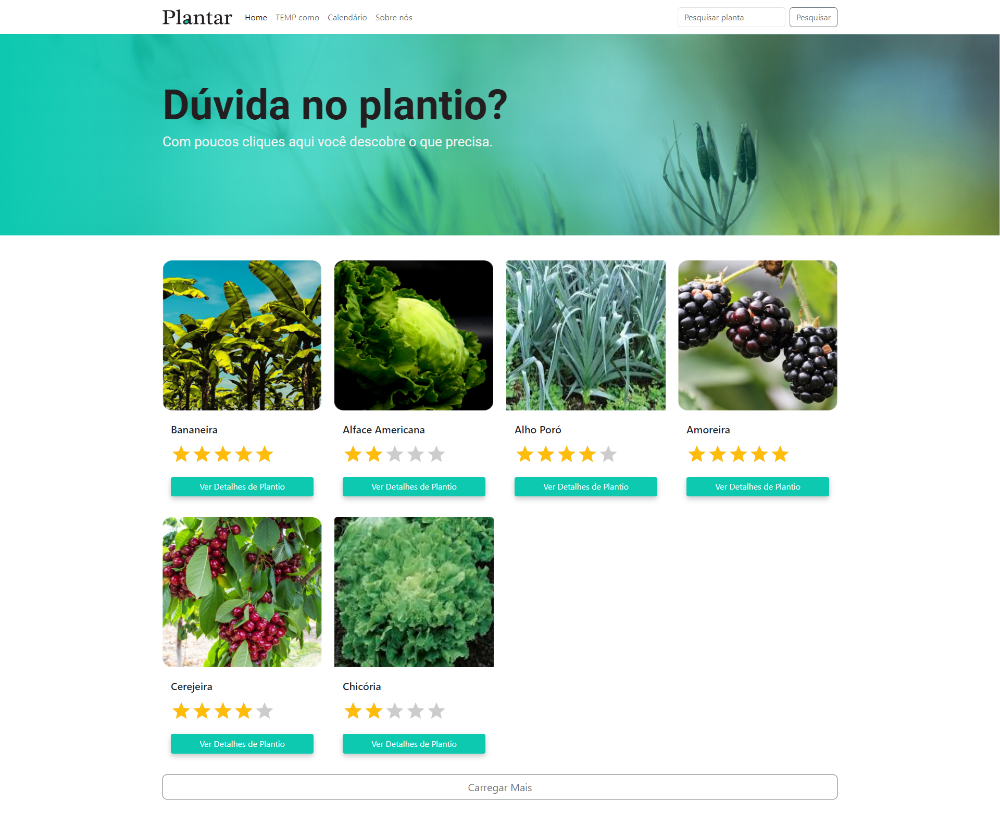
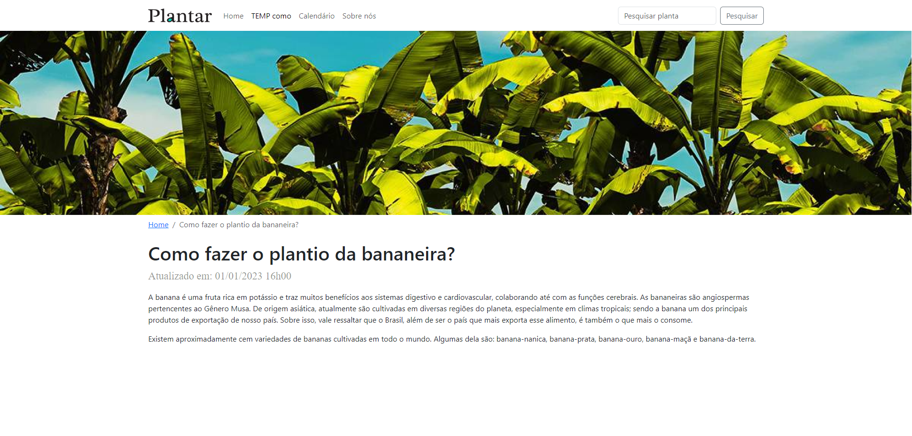
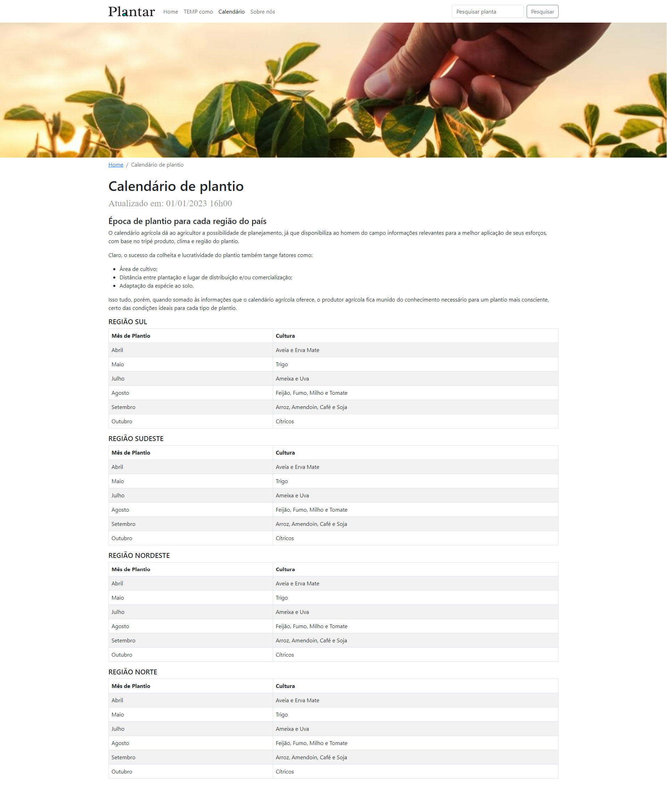
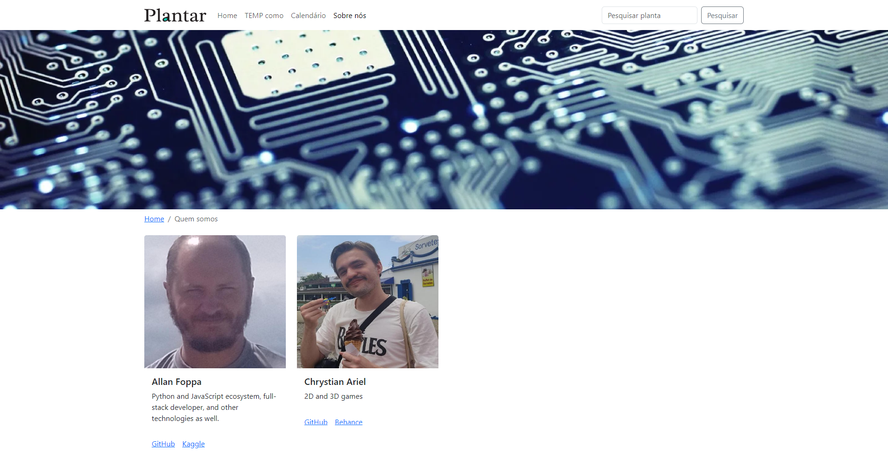

<!-- PROJECT LOGO -->
<!-- markdownlint-disable -->
<div align="center" style="margin-top: 24px">
  
  <h3 align="center">A server/client application to train FastAPI, Node.js, PostgreSQL, Docker, React, Bootstrap, React simple start rating.</h3>
</div>
<!-- markdownlint-disable -->

<!-- CONSIDERATIONS -->
## CONSIDERATIONS

This POC was interrupted due to the study of more urgent technologies for my daily work. I will return at some point to finish. But, still, I was able to have a great experience with what was developed. I want to thank my friend Chrystian (@chrystianariel) for the application design, it looks great!

<!-- LAYOUT PREVIEW -->
## LAYOUT

### Home




### How to planting



### Planting calendar



### Who we are



<!-- GETTING STARTED -->
## Getting Started

This is an example of how you may give instructions on setting up your project locally.

### Installation

1. Clone the repo

   ```shell
   git clone git@github.com:allanfoppa/plantar.git
   ```

2. Run a server command

   ```shell
   docker-compose up
   ```

## Contributing

Any contributions you make are **greatly appreciated**.
